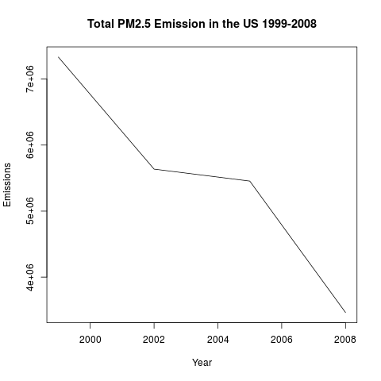
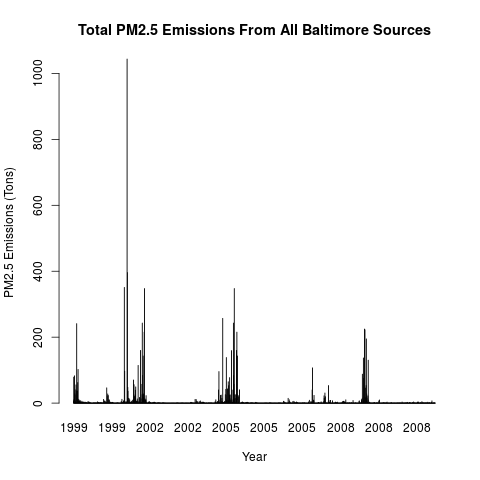
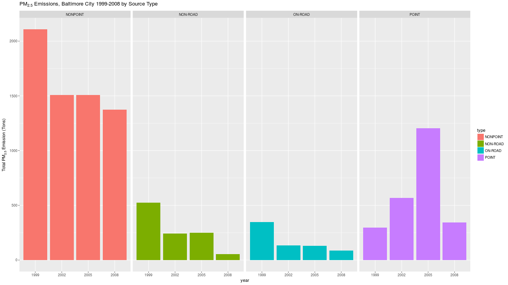
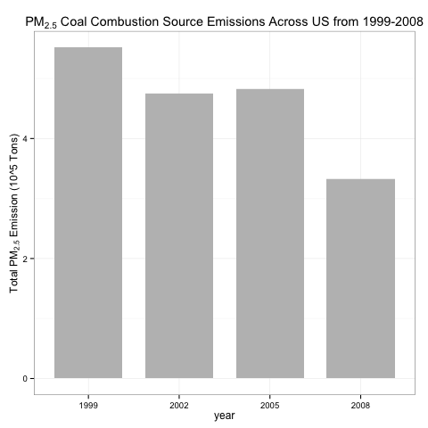
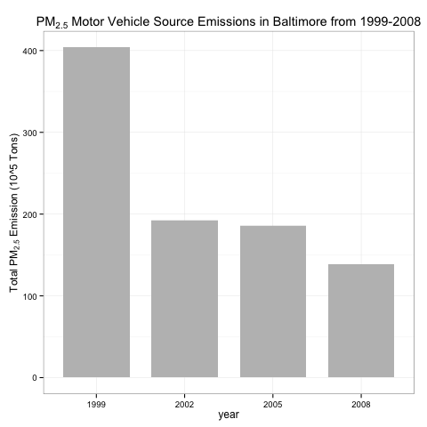

## Introduction

The [dataset](https://d396qusza40orc.cloudfront.net/exdata%2Fdata%2FNEI_data.zip) provided by [National Emissions Inventory](http://www.epa.gov/ttn/chief/eiinformation.html), approx 29 Mbs is used in this project to answer the following questions:

 1. Have total emissions from PM2.5 decreased in the United States from 1999 to 2008? Using the base plotting system, make a plot showing the total PM2.5 emission from all sources for each of the years 1999, 2002, 2005, and 2008.
 2. Have total emissions from PM2.5 decreased in the Baltimore City, Maryland 𝚏𝚒𝚙𝚜 == "𝟸𝟺𝟻𝟷𝟶" from 1999 to 2008? Use the base plotting system to make a plot answering this question.
 3. Of the four types of sources indicated by the 𝚝𝚢𝚙𝚎 (point, nonpoint, onroad, nonroad) variable, which of these four sources have seen decreases in emissions from 1999–2008 for Baltimore City? Which have seen increases in emissions from 1999–2008? Use the ggplot2 plotting system to make a plot answer this question.
 4. Across the United States, how have emissions from coal combustion-related sources changed from 1999–2008?
 5. How have emissions from motor vehicle sources changed from 1999–2008 in Baltimore City?
 6. Compare emissions from motor vehicle sources in Baltimore City with emissions from motor vehicle sources in Los Angeles County, California (𝚏𝚒𝚙𝚜 == "𝟶𝟼𝟶𝟹𝟽"). Which city has seen greater changes over time in motor vehicle emissions?

## Plots

#### Plot - 1

#### Plot - 2

#### Plot - 3

#### Plot - 4

#### Plot - 5

#### Plot - 6

